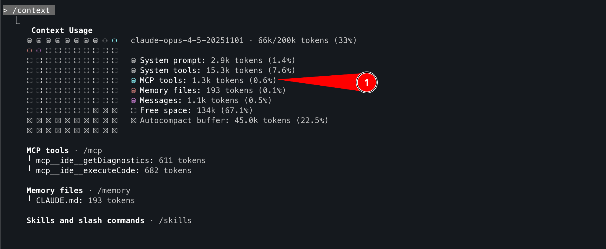
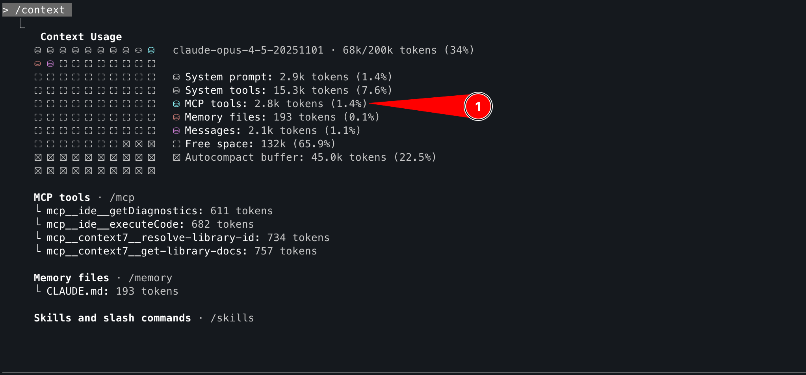

# Initial Configuration
1. Create a directory for your build to work out of using the terminal of your choice:

    ```
    mkdir mcp_demo
    ```

2. Change into the directory:

    ```
    cd mcp_demo
    ```

3. Create your `Claude.md` file.  This file will act as a jumping off point contextually for your application (use VSCode, or Terminal VIM).  Copy the following contents:

    ```
    # CLAUDE.md

    This file provides guidance to Claude Code (claude.ai/code) when working with code in this repository.

    ## Overview

    This demo is supposed to be showing how we utilize MCPs within the wider development process utilizing Claude Code itself.

    The application is utilizing the React and Tailwind frameworks to help generate a simple application that does the following:

    * Watch Claude Code use MCP servers to build a Pokémon fan site
    * Claude Code generates a polished React UI with Tailwind
    * Context7 provides current React/Tailwind documentation
    * Interactive Pokémon cards with stats and ratings
    * Application provides a filterable solution for different types of Pokémon.
    * When clicking on cards it displays the attributes of the Pokémon.

    ## Configuration

    The entire application will just be encapsulated in a single web page. There will be no stateful information saved as this is just a demo 
    ```

5. Start up Claude Code, famililarize yourself with the slash (/) commands of Claude, execute the following:

    ```
    /model - lists out models available to you.  Choose Sonnet or Opus.
    /stats - show your CC usage statistics.
    ```

6. Review your current context usage:

    ```
    /context
    ```

7. With no MCP servers loaded, your context available should be near the following:

    

4. Lets get some initial MCP servers configured for your application. Create a new `.mcp.json` and copy the following in.  This file is locally scoped to your project:

    ```
    {
        "mcpServers": {
            "context7": {
                "command": "npx",
                "args": ["-y", "@upstash/context7-mcp"]
            }
        }
    }
    ```

6. Validate that your MCP server is up and running using the `/mcp` command.

    


7. Note your context consumed has now increased:
    


# Lets Code, Err, Vibe Code

1. Our simple vibe coding approach is mostly ready to go.  This approach is simplistic in nature, there will be different results for almost everyone.  (Note: Spec-driven development will drive a more concise approach to output -- more on this later :-) )

2. Ensure that you're in the working directory `mcp_demo` and Claude is running.

3. Press `shift + tab` until you see planning mode.

4. Enter the following prompt to get started:
    ```
    Utilizing the provided context within @CLAUDE.md please develop the example application found in the overview section.  Please note we're specifically using React with Tailwind to define this project.  Do not test at this time just start up the server.  
    ```

5. Before Claude executes, note the plan of execution.  You have the opportunity to correct the course of action before it actually begins.

6. Once you're okay with the plan, proceed with executing your first prompt.  Claude will ask about tool execution, please answer accordingly.  Wait for the prompt to finish and check out your newly created website.

7. Update your `.mcp.json` to contain the following newly added MCP servers:  

    ```
    {
        "mcpServers": {
            "context7": {
                "command": "npx",
                "args": ["-y", "@upstash/context7-mcp"]
            },
            "playwright": {
                "type": "stdio",
                "command": "npx",
                "args": [
                    "@playwright/mcp@latest"
                ],
                "env": {}
            }
        }
    }
    ```

8. Ensure your Claude Code is restarted, press `Ctrl + c, Ctrl + c` (twice).  Restart Claude to pick up the new MCP changes.  Please note that on first run the Playwright MCP server is designed to automatically handle the installation of the necessary browser binaries, including Chromium, Firefox, and WebKit, when they are first required. 

9. With Claude running in the same working directory as before, execute the following prompt:

    ```
    Please ensure my application is running as a background task.  Using playwright-mcp please: 
    * Validate the filtering for various Pokemon characters works
    * Validate that each card when clicked displays detailed information.
    * Validate the search functionality shows cards searched for (Charizard for instance)
    ```


Notes:
The working build is located here for reference -> https://github.com/toddward/claude-code-mcp-demo